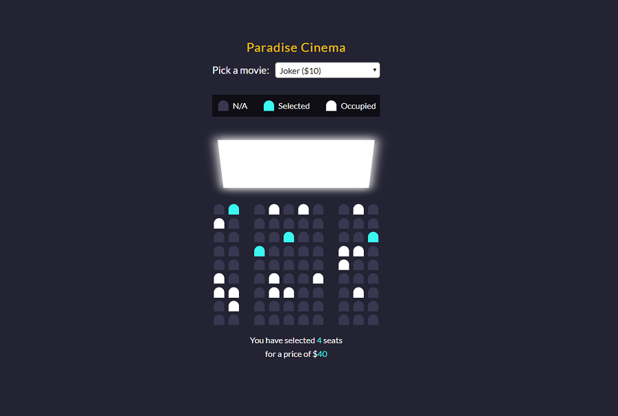

# Movie Seat Booking

Movie Seat Booking is a javascript app. It display a cinema room with seats already occupied and avalible. It is possible to choose a number of avalible seats and app shows number of seats with overall price for chosen seats. It is also possible to choose a one movie from avalible with different price for movie 

## Tools & Technology used

- Visual Studio Code
- JavaScript
- HTML
- SCSS
- Gulp

# gulp-starter

`npm install -g gulp-cli`

`npm install`

`gulp`

To publish your page using github pages use `npm run deploy`
